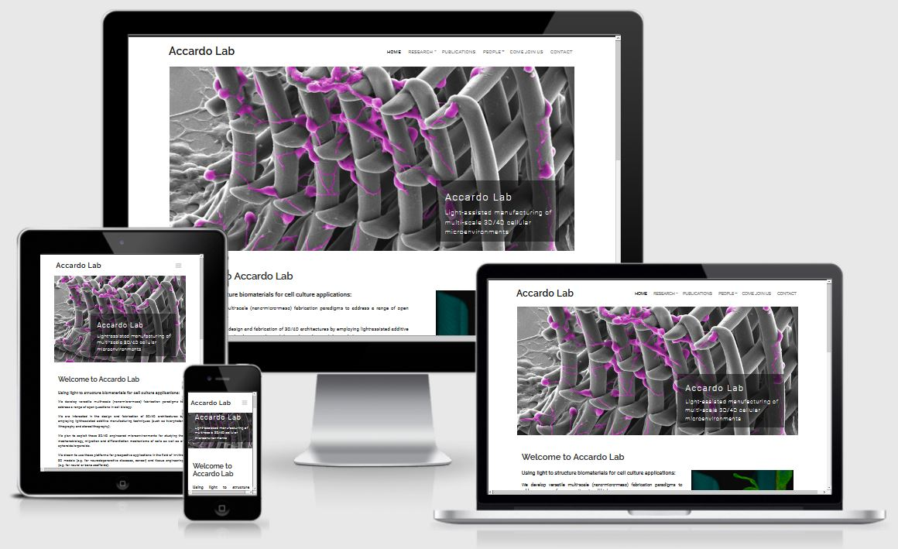

# Accardo Lab Website

[View the live project here.](https://victoriashalabaeva.github.io/Accardo-Lab/)

Accardo Lab is a website of the research group supervised by Angelo Accardo, assistant professor at the Delft University of Technology (TU Delft). 

The website is particularly dedicated to the scientific community specialized in the field of Life Sciences, TU Delft students, group partners and collaborators. 

The website is designed to be responsive and accessible on a range of devices, making it easy to navigate through.



## User Experience (UX)

- ### User stories

  - **As a research scientist from an external institution:**

    - I want to easily understand the main areas of research of the group and learn more about it.
    - I want to be able to easily navigate throughout the site to find content.
    - I want to look for a publication list with DOI links provided.
    - I want to find contact information for discussing possible collaborations.

  - **As a Master student of TU Delft:**
    
    - I want to easily understand the main areas of research of the group and learn more about it.
    - I want to be able to easily navigate throughout the site to find content.
    - I want to look for the currently available Master students assignments.
    - I want to find the contact information to discuss the possibility to conduct a thesis research in the group.

  - **As a candidate looking for potential job opportunities:**
    
    - I want to easily understand the main areas of research of the group and learn more about it.
    - I want to be able to easily navigate throughout the site to find content.
    - I want to look for the currently available open positions.
    - I want to know the group members.
    - I want to find the contact information.

  - **As a high-tech company and general audience:**

    - I want to easily understand the main areas of research of the group and learn more about it.
    - I want to be able to easily navigate throughout the site to find content.
    - I want to find contact information for discussing possible collaborations.
    - I want to locate social media links to see their followings on social media.

  - **As a group member or colleague from the same faculty:**

    - I want to be updated on the recent events of the group.
    - I want to look for the publication list with DOI links provided.
    - I want to find a group members list to check name or email address spelling.
    - I want to be able to easily navigate throughout the site to find content.
      
- ### Design

  - **Colour Scheme**

     The three main colours used are dark grey (#494949), light grey (#f8f9fa) and white.

  - **Typography**

    The Roboto (main text body) and Raleway (headings) fonts are the main fonts used throughout the whole website with Sans Serif as the fallback font in case for any reason the font isn't being imported into the site correctly. Roboto and Raleway are clean fonts used frequently in programming, so they are both attractive and appropriate.

  - **Imagery**
     
     The large background hero images are designed to be striking and catch the user's attention. They are also informative and demonstrate the scientific results of the group.

- ### Wireframes

  - *Home* page - [View](assets/pdf/home_page.pdf)

  - *Research* page - [View](assets/pdf/research_page.pdf)

  - *Publications* page - [View](assets/pdf/publications_page.pdf)

  - *People* page - [View](assets/pdf/people_page.pdf)

  - *Come join us* page - [View](assets/pdf/come_join_us_page.pdf)

  - *Contact* page - [View](assets/pdf/contact_page.pdf)

## Features

- The website is responsive on all device sizes.

- The website contains several pages including *Home*, *Research*, *Publications*, *People*, *Come join us* and *Contact* pages. This thematic division facilitates the website navigation.

- The *Home* page contains a Bootstrap carousel that summarizes the latest news of the group in a concise manner and allows to keep the page length  short.

- The website contains appealing hero images that immediately  catch the user's attention and give a flavour of the main activity and results of the group. 

- Each article in the publication list contains a DOI link which significantly saves user's time (no need to google further).

- The *Contact* page contains a Google map that facilitates a trip planning for visitors.

## Technologies Used

### Languages Used

- HTML5

- CSS3

### Frameworks, Libraries & Programs Used

1. [Bootstrap 4.1.3:](https://getbootstrap.com/docs/4.1/getting-started/introduction/)
   
   Bootstrap was used to assist with the responsiveness and styling of the website.

2. [Google Fonts:](https://fonts.google.com/)

   Google fonts Roboto and Raleway were used on all pages throughout the project.

3. [Font Awesome:](https://fontawesome.com/)

   Font Awesome was used in the footer throughout the website to add icons for social links.


4. [jQuery:](https://jquery.com/)

   jQuery came with Bootstrap to support Carousel for all slide behaviors, controls, and indicators; to make the navbar responsive.

5. [GitPod:](https://www.gitpod.io)

   GitPod was used for the whole project development.

6. [GitHub:](https://github.com/)

   GitHub is used to store the projects code after being pushed from GitPod.

7. [Balsamiq:](https://balsamiq.com/)

   Balsamiq was used to create the wireframes during the design process.

## Testing

The W3C Markup Validator and W3C CSS Validator Services were used to validate every page of the project to ensure there were no syntax errors.

- [W3C Markup Validator](https://validator.w3.org/). Please see Figure S2 in [Supp Info](supp-info.md) for the result.
- [W3C CSS Validator](https://jigsaw.w3.org/css-validator/). Please see Figure S3 in [Supp Info](supp-info.md) for the result.

### Testing User Stories from User Experience (UX) Section

- *I want to easily understand the main areas of research of the group and learn more about it.*

  - Upon entering the site, users are automatically greeted with a clean and easily readable navigation bar to go to the page of their choice. Underneath there is a hero image with a cover text (the main points are made immediately with the hero image).
  - The user can scroll down and read the main goals of the group.
  - The user can click on *Research*, appreciate the microfabricated scaffolds illustrated in the hero image of the page and get a first impression on the scientific activity of the group. The text below than briefly describes the main concepts.
  
- *I want to be able to easily navigate throughout the site to find content.*

  - At the top of each page there is a clean navigation bar, each link describes what the page they will end up at clearly.
  - The logo title (*Accardo Lab*) always leads back to the home page.
  - As it is usually expected, at the bottom of each page there is a footer that contains contact information and social links.
  
- *I want to look for a publication list with DOI links provided.*

  - User can find the full list of publications on the *Publications* page which is clearly labelled and easy to find in the navigation on every page.
  - Each article has a DOI link that brings to the journal website with the publication. This significantly reduces the user's search time.

- *I want to find contact information for discussing possible collaborations.*

  - The contact information can be found at the *Contact* page and at the bottom of each page. A clearly labelled *Contact* page is easy to find in the navigation bar on every page.
  - The *Contact* page also contains a Google map for the visiting address.
  - Additionally the email addresses of key group members (group leader and PhD students) are provided at the *People* page next to the photos.

- *I want to look for the currently available Master students assignments.*

  - A clearly labelled *Come join us* page is easy to find in the navigation bar on every page.
  - Upon entering the *Come join us* page, a Master student will see a hero image illustrating a work in the laboratory. This should immediately create a right impression of an experimental research in the group rather than theoretical one.
  - A Master student can find the list of available thesis projects after the hero image.

- *I want to look for the currently available job positions.*

  - The potential candidate can easily find open vacancies on the "Come join us" page. 
  - A clearly labelled *Come join us* page is easy to find in the navigation bar on every page.

- *I want to locate social media links to see their followings on social media.*

  - Social links can be found at the bottom of each page.
  - Additionally the links to the hierarchically higher institutions can be also found: the websites of the department, faculty and university.

- *I want to see the list of group member.*

  - User can find the list of group members on the *People* page. 
  - A clearly labelled *People* page is easy to find in the navigation bar on every page.
  - Each group member is presented with his photo, name and email address (if available).

- *I want to be updated on the recent events of the group.*

  - User can find the latest news of the group on the *Home* page presented by an interective element (Bootstrap carousel) which briefly presents the recent group activity.

### Further Testing

- The website was checked for performance with [Lighthouse](https://developers.google.com/web/tools/lighthouse) in chrome devtools.

- The Website was tested on Google Chrome, Internet Explorer, Microsoft Edge and Safari browsers.

- The website was viewed on a variety of devices such as Desktop, Laptop, iPhoneXR and Huawei Mate 20.

- A large amount of testing was done to ensure that all pages were linking correctly.

- Friends and family members were asked to review the site and documentation to point out any bugs and/or user experience issues.

### Bugs

  - Up to my knowledge there is no bug present in the website. 

  - All the malfunctions were tried to be fixed during the development process.

  - Thank you for contacting the developer <shalabaevavt@gmail.com> if any bug is identified.

  - During the development process, the particular difficulty was met with:
  
      - Formatting the *News* section in the *Home* page:
          - large amount of content, 
          - cards integration inside a carousel,
          - optimization their sizing on different devices,
          - fitting images with different dimensions and aspect rations in unique size container in cards. 

      - Working with hero images, in particular the hero image on *Research* page and *Publications*. 
  
  - **Fixed bug**

      - All pages of the website had an additional white space that was causing a horizontal page scrolling (please see Figure S1 in [Supp Info](supp-info.md)).
      - It was discovered that the hero image container had an extra padding and margin space. 
      - The issue was solved by adding an additional classes to standard Bootstrap .row and .col classes in order to style specifically the containers of the hero images.
        
## Deployment

### GitHub Pages

The project was deployed to GitHub Pages using the following steps:

1. Log in to GitHub and locate the [GitHub Repository](https://github.com/).

2. At the top of the Repository (not top of page), locate the "Settings" Button on the menu.

3. Scroll down the Settings page until you locate the "GitHub Pages" Section.
    
4. Under "Source", click the dropdown called "None" and select "Master Branch".
    
5. The page will automatically refresh.
    
6. Scroll back down through the page to locate the now published site link in the "GitHub Pages" section.

### Forking the GitHub Repository

By forking the GitHub Repository we make a copy of the original repository on our GitHub account to view and/or make changes without affecting the original repository by using the following steps:

1. Log in to GitHub and locate the [GitHub Repository](https://github.com/).
    
2. At the top of the Repository (not top of page) just above the "Settings" Button on the menu, locate the "Fork" Button.

3. You should now have a copy of the original repository in your GitHub account.

### Making a Local Clone

1. Log in to GitHub and locate the [GitHub Repository](https://github.com/).
    
2. Under the repository name, click "Clone or download".
    
3. To clone the repository using HTTPS, under "Clone with HTTPS", copy the link.
    
4. Open Git Bash.
    
5. Change the current working directory to the location where you want the cloned directory to be made.
    
6. Type `git clone`, and then paste the URL you copied in Step 3.

    ```
    $ git clone https://github.com/YOUR-USERNAME/YOUR-REPOSITORY
    ```

7. Press Enter. Your local clone will be created.

   ```
   $ git clone https://github.com/YOUR-USERNAME/YOUR-REPOSITORY
   > Cloning into `CI-Clone`...
   > remote: Counting objects: 10, done.
   > remote: Compressing objects: 100% (8/8), done.
   > remove: Total 10 (delta 1), reused 10 (delta 1)
   > Unpacking objects: 100% (10/10), done.

Click [Here](https://docs.github.com/en/github/creating-cloning-and-archiving-repositories/cloning-a-repository#cloning-a-repository-to-github-desktop) to retrieve pictures for some of the buttons and more detailed explanations of the above process.

## Credits

### Code

- [Bootstrap4:](https://getbootstrap.com/docs/4.0/getting-started/introduction/) Bootstrap Library used throughout the project:

  - Grid System to make the site responsive,

  - Navbar to make a responsive navigation header,

  - Cards to make flexible and extensible content containers,

  - Carousel to make a slideshow for cycling through a series of content.

- Some styling approaches were adapted from Code Institute tutorial lessons.

- The Google map was integrated through [Google Map Generator](https://google-map-generator.com/).

### Content

- All content was provided by Angelo Accardo.

- The present README file was written following the [template](https://github.com/Code-Institute-Solutions/SampleREADME) provided by Code Institute. Some parts (like Deployment section) were copied and pasted as they describe exactly the same procedure that was employed for the realization of this project.

### Media

- The hero image on the *Come Join Us* page was downloaded from [Here](https://www.pexels.com/photo/adult-biology-chemical-chemist-356040/).

- The hero image on the *Contact* page was downloaded from [TU Delft website](https://www.tudelft.nl/en/education/programmes/masters/cosem/msc-complex-systems-engineering-and-management/studying-at-tu-delft).

- All other images were provided by Angelo Accardo.

### Acknowledgements

- My mentor for continuous helpful feedback.

- My husband (Angelo Accardo) for all provided content material.

