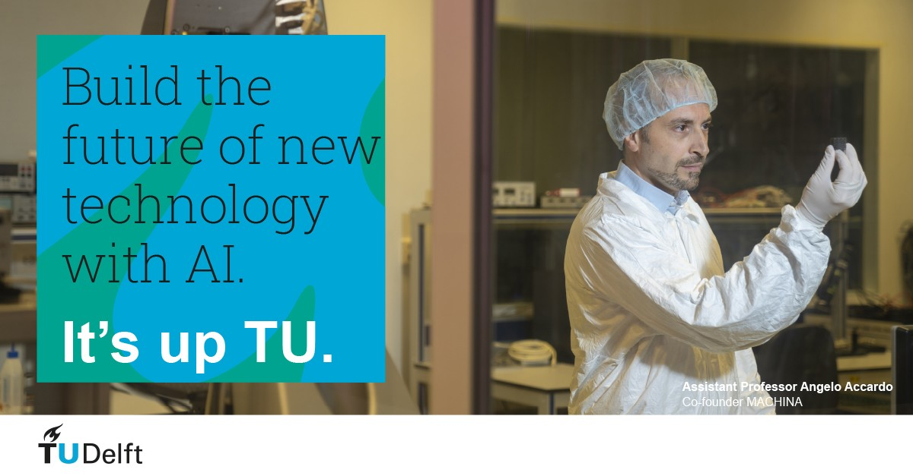

# Accardo Lab Website

[View the live project here.](https://victoriashalabaeva.github.io/Accardo-Lab/)

This is the main website for Accardo Lab. It is designed to be responsibe and accessible on a range of devices, making it easy to navigate for scientific community, students and collaborators.



## User Experience (UX)
***

- ### User stories

- ### Design

  - **Colour Scheme**

     The three main colours used are dark grey (#494949), light grey (#f8f9fa) and white.

  - **Typography**

    The Roboto (main text body) and Raleway (headings) fonts are the main fonts used throughout the whole website with Sans Serif as the fallback font in case for any reason the font isn't being imported into the site correctly. Roboto and Raleway are clean fonts used frequently in programming, so they are both attractive and appropriate.

  - **Imagery**
     
     Imagery is important. The large, background header images are designed to be striking and catch the user's attention. It also has a modern, energetic aesthetic.

- ### Wireframes

  - Home Page Wireframe - [View](#)

  - Mobile Wireframe - [View](#)

  - Contact Us Page Wireframe - [View](#)

## Features
***

- Responsive on all device sizes

- Interactive elements

## Technologies Used
***

### Languages Used

- HTML5

- CSS3

### Frameworks, Libraries & Programs Used

1. [Bootstrap 4.1.3:](https://getbootstrap.com/docs/4.1/getting-started/introduction/)
   
   Bootstrap was used to assist with the responsiveness and styling of the website.

2. [Google Fonts:](https://fonts.google.com/)

   Google fonts Roboto and Raleway were used on all pages throughout the project.

3. [Font Awesome:](https://fontawesome.com/)

   Font Awesome was used in the footer throughout the website to add icons for soscial links.


4. [jQuery:](https://jquery.com/)

   jQuery came with Bootstrap to support Carousel for all slide behaviors, controls, and indicators; to make the navbar responsive.

5. [GitPod:](https://www.gitpod.io)

   GitPod was used for the whole project development.

6. [GitHub:](https://github.com/)

   GitHub is used to store the projects code after being pushed from Git.

7. [Balsamiq:](https://balsamiq.com/)

   Balsamiq was used to create the wireframes during the design process.

## Testing
***

The W3C Markup Validator and W3C CSS Validator Services were used to validate every page of the project to ensure there were no syntax errors in the project.

- [W3C Markup Validator](https://validator.w3.org/)
- [W3C CSS Validator](https://jigsaw.w3.org/css-validator/)

### Testing User Stories from User Experience (UX) Section

- **First Time Visitor Goals**

- **Returning Visitor Goals**

- **Frequent User Goals**

### Further Testing

- The Website was tested on Google Chrome, Internet Explorer, Microsoft Edge and Safari browsers.

- The website was viewed on a variety of devices such as Desktop, Laptop, iPhone7, iPhone 8 & iPhoneX.

- A large amount of testing was done to ensure that all pages were linking correctly.

- Friends and family members were asked to review the site and documentation to point out any bugs and/or user experience issues.

### Known Bugs

## Deployment
***

### GitHub Pages

The project was deployed to GitHub Pages using the following steps:

1. Log in to GitHub and locate the GitHub Repository.

2. At the top of the Repository (not top of page), locate the "Settings" Button on the menu.

   Alternatively Click Here for a GIF demonstrating the process starting from Step 2.
    
3. Scroll down the Settings page until you locate the "GitHub Pages" Section.
    
4. Under "Source", click the dropdown called "None" and select "Master Branch".
    
5. The page will automatically refresh.
    
6. Scroll back down through the page to locate the now published site link in the "GitHub Pages" section.

### Forking the GitHub Repository

By forking the GitHub Repository we make a copy of the original repository on our GitHub account to view and/or make changes without affecting the original repository by using the following steps:

1. Log in to GitHub and locate the GitHub Repository.
    
2. At the top of the Repository (not top of page) just above the "Settings" Button on the menu, locate the "Fork" Button.

3. You should now have a copy of the original repository in your GitHub account.

### Making a Local Clone

1. Log in to GitHub and locate the [GitHub Repository](https://github.com/).
    
2. Under the repository name, click "Clone or download".
    
3. To clone the repository using HTTPS, under "Clone with HTTPS", copy the link.
    
4. Open Git Bash
    
5. Change the current working directory to the location where you want the cloned directory to be made.
    
6. Type `git clone`, and then paste the URL you copied in Step 3.

    ```
    $ git clone https://github.com/YOUR-USERNAME/YOUR-REPOSITORY
    ```

7. Press Enter. Your local clone will be created.

   ```
   $ git clone https://github.com/YOUR-USERNAME/YOUR-REPOSITORY
   > Cloning into `CI-Clone`...
   > remote: Counting objects: 10, done.
   > remote: Compressing objects: 100% (8/8), done.
   > remove: Total 10 (delta 1), reused 10 (delta 1)
   > Unpacking objects: 100% (10/10), done.

Click [Here](https://docs.github.com/en/github/creating-cloning-and-archiving-repositories/cloning-a-repository#cloning-a-repository-to-github-desktop) to retrieve pictures for some of the buttons and more detailed explanations of the above process.

## Credits
***

### Code

- [Bootstrap4:](https://getbootstrap.com/docs/4.0/getting-started/introduction/) Bootstrap Library used throughout the project:

  - to make site responsive using the Bootstrap Grid System,

  - to integrate Bootstrap Cards,

  - to integrate Bootstrap Carousel.

- Some styling approaches were adapted from Code Institute tutorial lessons.

- The Google map was integrated through [Google Map Generator](https://google-map-generator.com/).

### Content

- All content was provided by Angelo Accardo.

- The present README file was written following the [template](https://github.com/Code-Institute-Solutions/SampleREADME) provided by Code Institute.

### Media

- The header image on the Come Join Us page was downloaded from [Here](https://www.pexels.com/photo/adult-biology-chemical-chemist-356040/).

- The header image on the Contact page was downloaded from [TU Delft website](https://www.tudelft.nl/en/education/programmes/masters/cosem/msc-complex-systems-engineering-and-management/studying-at-tu-delft).

- All other images were provided by Angelo Accardo.

### Acknowledgements

- My Mentor for continuous helpful feedback.

- My husband (Angelo Accardo) for all provided content material.

