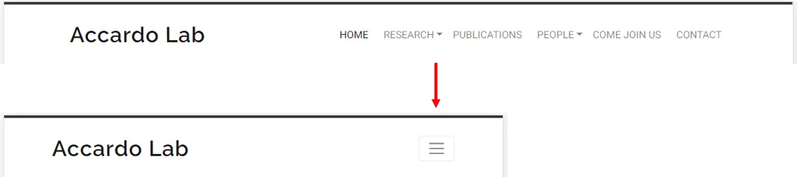
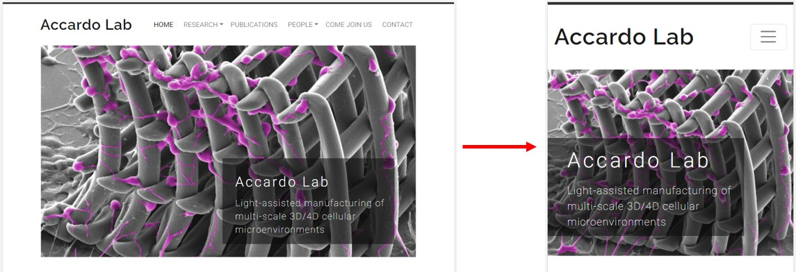
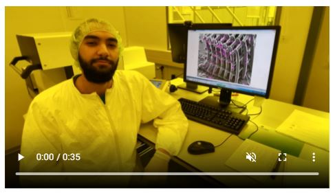
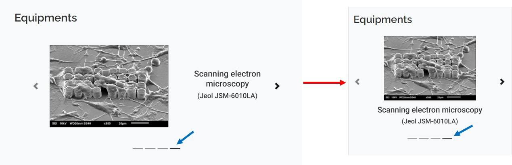
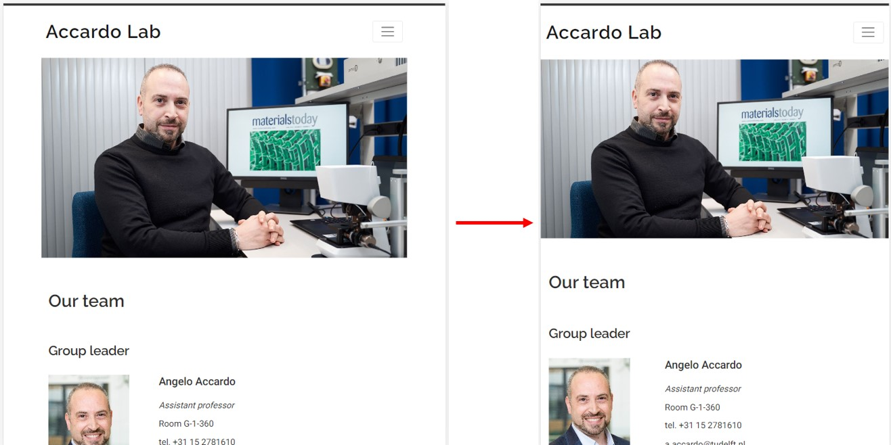
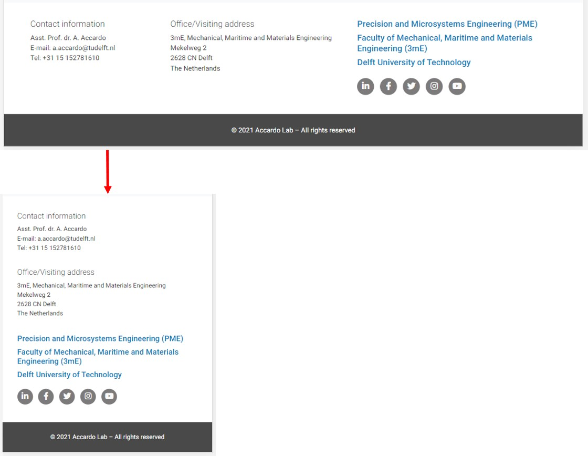

# Testing Functionality, Usability and Responsiveness

Functionality, Usability and Responsiveness of the key website elements were tested manually following the plan:

### Navigation bar:

  - The navbar automatically collapses at the lg (large) breakpoint (992px).

    

  - The *Research* and *People* buttons have a dropdown menu which is toggled by clicking, not by hovering.

    

  - The current page is indicated by a darker grey font colour (see examples in images above: *Home* button has a darker colour, *Research* button as well as its submenu have a darker font colour).

  - All buttons of the navbar are clickable and open correct pages.

### *Home* page hero image:

  - Each time the *Home* page is loaded the hero image has an animation (zooming effect).

  - At a certain breakpoint (small device, 576 px), the cover text container jumps from the right side to the left side. 

    

### *News* section on the *Home* page:

  - To ensure correct card/carousel sizing (paying attention that the text fits in the container).

  - Images (while resizing themselves) are visualised in a correct manner (where it is necessary, image cropping is avoided for readability; in order to keep the same image container size, an individual background was added). 

  - Carousel back and forward buttons are functional. The automatic slide scrolling was deliberately deactivated in order to have enough time to read. 

    

### Video on the *Research* page:
 
  - Video should have control buttons.

  - Video plays by pushing *play* button.

  - Video does not have an autoplay feature.

    

### *Equipment* section on the *Research* page:

  - Carousel back and forward buttons are functional.
  
  - The automatic slide scrolling is active.

  - The indicators underneath the slides are active (see image below, highlighted by a blue arrow).

  - At a certain breakpoint, carousel rearranges its layout correctly.

    

### *People* page:

  - Photos and text are not overlapped.

### Google map:

  - Google map is displayable and functional (by clicking *View larger map* it opens a separate page with google maps).

  - Google map is responsive and resizes itself correctly.

### Hero images:

  - Each hero image was checked to resize in a "aesthetic acceptable" manner.

### General layout of pages:

  - At a certain breakpoint (medium device, 768 px), the left and right spaces disappear. It was checked that a navbar, hero image, text and other elements present on a page fill out all the available space.

    

  - Bootstrap .col-x-y elements position themselves in a correct manner when passing from one screen size to another.

  - Footer changes its layout when passing a certain breakpoint (medium device, 768 px).

    

### Links:

  - All links to external pages open in a separate tab when clicked.

  - There are no broken internal links.