# Supplementary information

## Testing User Stories from User Experience (UX) Section

- *I want to easily understand the main areas of research of the group and learn more about it.*

  - Upon entering the site, users are automatically greeted with a clean and easily readable navigation bar to go to the page of their choice. Underneath there is a hero image with a cover text (the main points are made immediately with the hero image).

    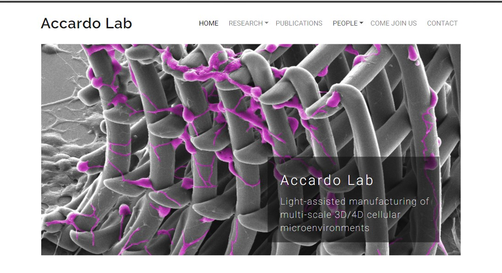

  - The user can scroll down and read the main goals of the group.

    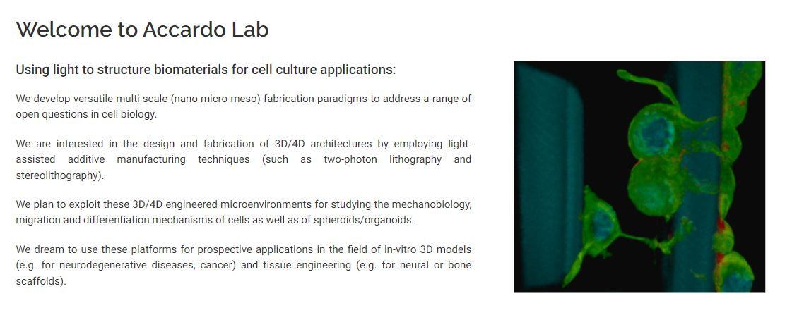

  - The user can click on *Research*, appreciate the microfabricated scaffolds illustrated in the hero image of the page and get a first impression on the scientific activity of the group. 
    
    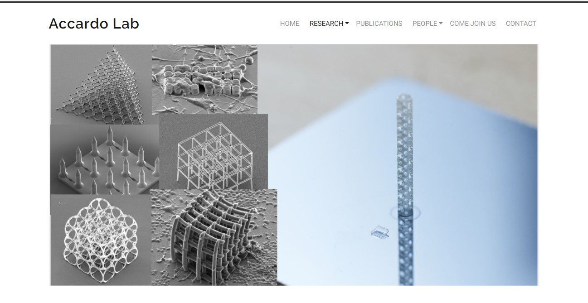

  - The text below than briefly describes the main concepts (this is also supported with a schematic image and video where one of the PhD students of the group describes his research project). 
    
    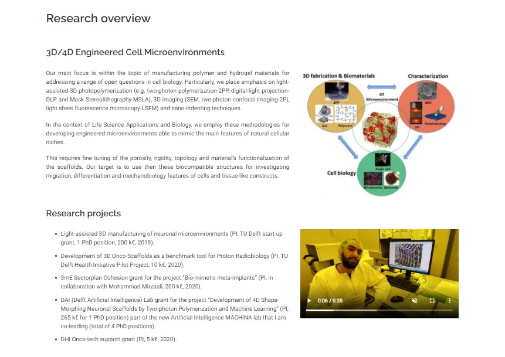

  - Further there is a slide show presentation with the main instruments available at the lab as well as a list of the lab courses.

    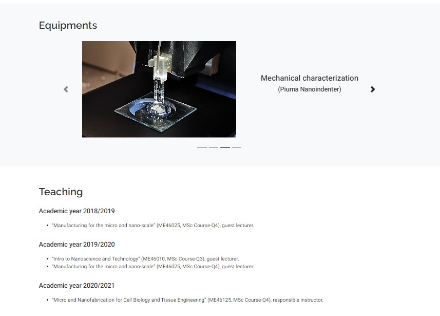
  
- *I want to be able to easily navigate throughout the site to find content.*

  - At the top of each page there is a clean navigation bar, each link describes what the page they will end up at clearly.

  - The logo title (*Accardo Lab*) always leads back to the *Home* page.

    

  - As it is usually expected, at the bottom of each page there is a footer that contains contact information and social links.

    
  
- *I want to look for a publication list with DOI links provided.*

  - User can find the full list of publications on the *Publications* page which is clearly labelled and easy to find in the navigation on every page.

    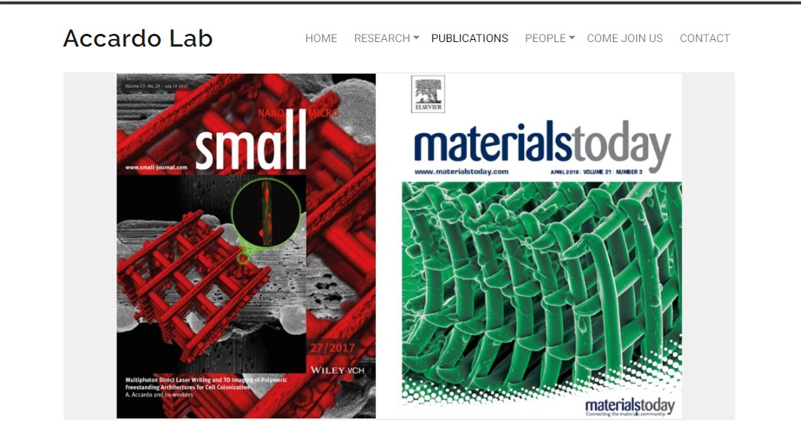

  - Each article has a DOI link that brings to the journal website with the publication. This significantly reduces the user's search time.

    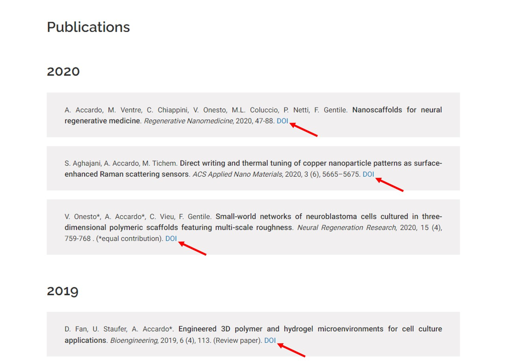

- *I want to find contact information for discussing possible collaborations.*

  - The contact information can be found on the *Contact* page and at the bottom of each page (footer). 

    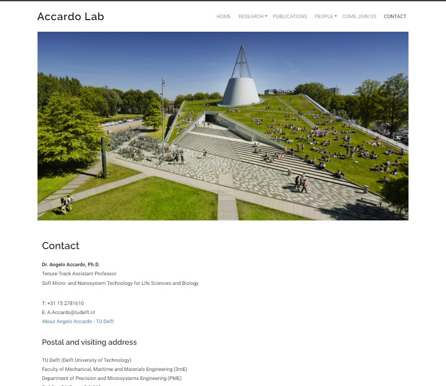

  - The *Contact* page also contains a Google map for the visiting address.

    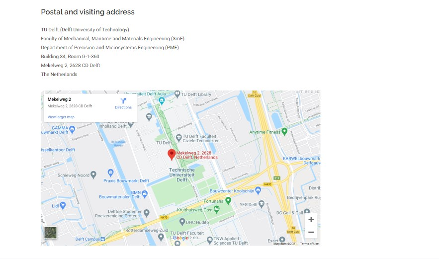

  - The email addresses of key group members (group leader and PhD students) are provided on the *People* page next to the photos.

    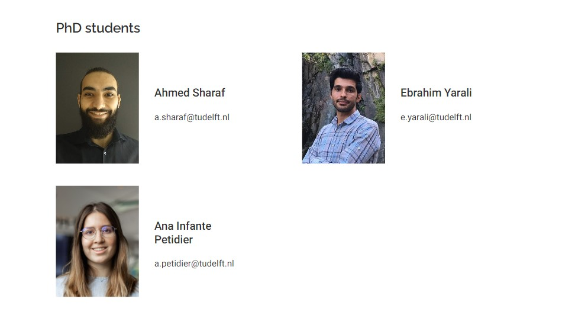
  
- *I want to look for the currently available Master students assignments.*

  - A clearly labelled *Come join us* page is easy to find in the navigation bar on every page.
  - Upon entering the *Come join us* page, a Master student will see a hero image illustrating a work in the laboratory. This should immediately create a right impression of an experimental research in the group rather than theoretical one.
  - A Master student can find the list of available thesis projects after the hero image.

    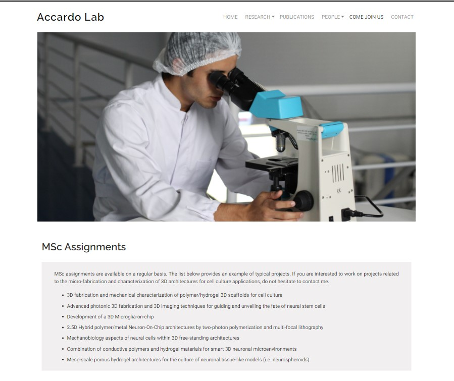

- *I want to look for the currently available job positions.*

  - The potential candidate can easily find open vacancies on the *Come join us* page. 
  - A clearly labelled *Come join us* page is easy to find in the navigation bar on every page.

    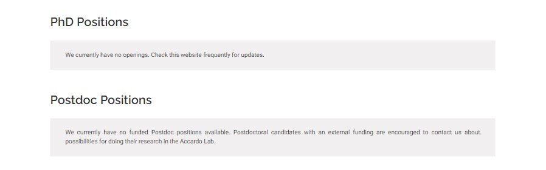

- *I want to locate social media links to see their followings on social media.*

  - Social links can be found at the bottom of each page.
  - Additionally the links to the hierarchically higher institutions can be also found: the websites of the department, faculty and university.

    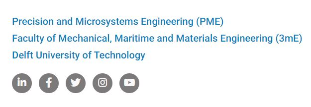

- *I want to see the list of group member.*

  - User can find the list of group members on the *People* page. 
  - A clearly labelled *People* page is easy to find in the navigation bar on every page.
  - Each group member is presented with his photo, name and email address (if available).

    

- *I want to be updated on the recent events of the group.*

  - User can find the latest news of the group on the *Home* page presented by an interactive element (Bootstrap carousel) which briefly presents the recent group activity.

    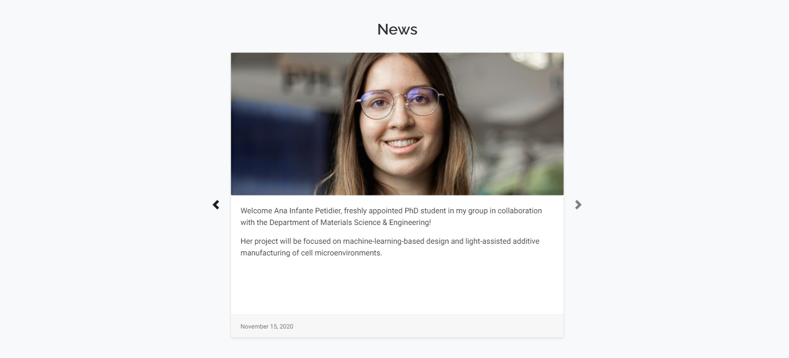

### Testing Functionality, Usability and Responsiveness

Functionality, Usability and Responsiveness of the key website elements were tested manually following the plan:

- Navigation bar:

  - The navbar automatically collapses at the lg (large) breakpoint (992px).

    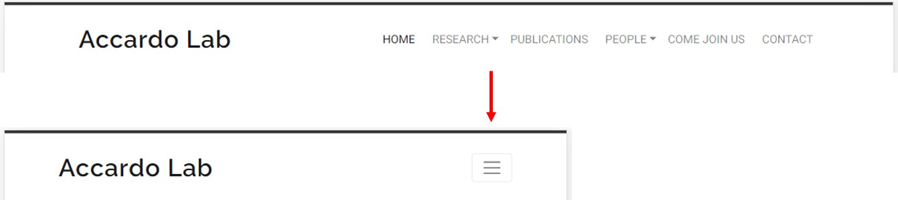

  - The *Research* and *People* buttons have a dropdown menu which is toggled by clicking, not by hovering.

    

  - The current page is indicated by a darker grey font colour (see the examples in images above: *Home* button has a darker colour, *Research* button as well as its submenu have a darker font colour.)

  - All buttons of the navbar are clickable and open the right pages.

- *Home* page hero image:

  - each time the *Home* page is loaded the hero image has an animation (zooming effect).

  - at a certain breakpoint (small device, 576 px), the cover text container jumps from the left side to the right side. 

    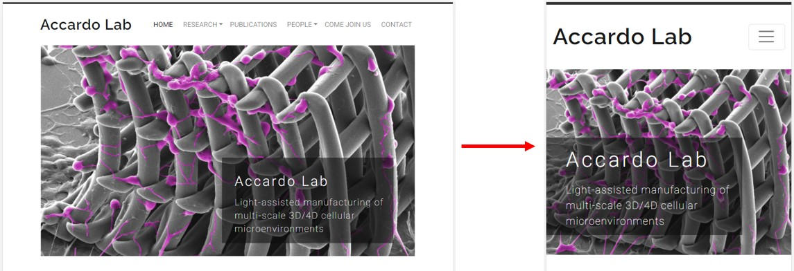

- *News* section on the *Home* page:

  - Correct card and carousel (combined) sizing (paying attention that the text fits in the container.

  - Images (while resizing themselves) are visualised in a correct manner (where it is necessary, image cropping is avoided for readability; in order to keep the same image container size, an individual background was added). 

  - Carousel back and forward buttons are functional. The automatic slide scrolling was deliberately deactivated in order to leave a user enough time to read. 

    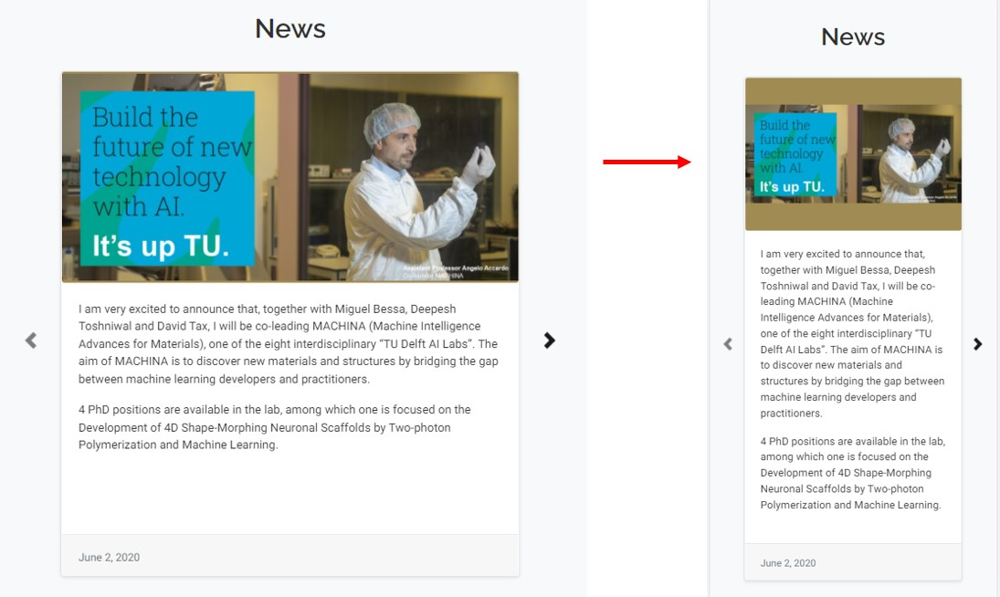

- Video on the *Research* page:
 
  - video has control buttons,

  - it plays by pushing *play* button,

  - video is muted,

  - video does not have an autoplay feature.

    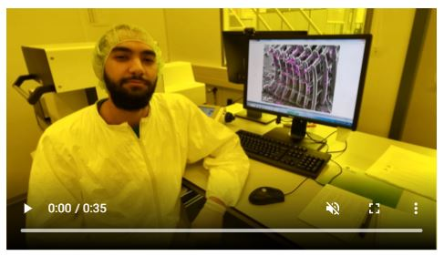

- *Equipment* section on the *Research* page:

  - Carousel back and forward buttons are functional,
  
  - The automatic slide scrolling is active,

  - The indicators underneath the slides are active (see image below, highlighted by a blue arrow),

  - At a certain breakpoint, carousel rearranges its layout correctly.

    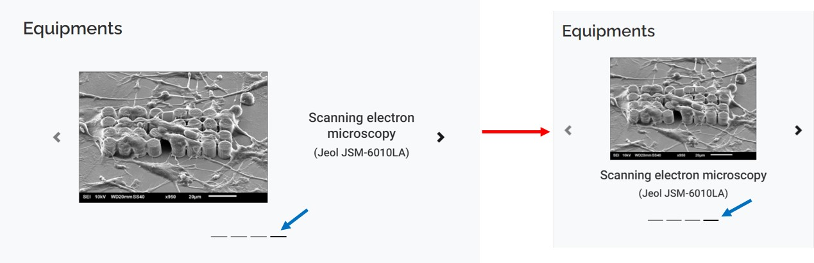

- *People* page:

  - Photos and text are not overlapped.

- Google map:

  - Google map is displayable and functional (by clicking it opens a separate page with google maps)

  - Google map is responsive and resizes itself correctly.

- Hero images:

  - each hero image was checked to resize in a ecstatically acceptable manner.

- General layout of pages:

  - At a certain breakpoint (medium device, 768 px), the left and right "paddings" disappear. It was checked that a navbar, hero image, text and other elements present on a page fill out all the available space.

    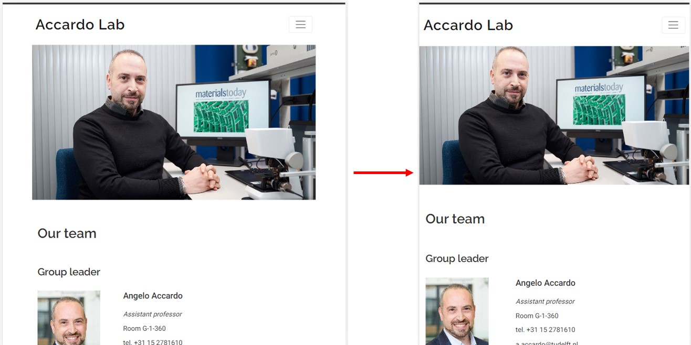

  - Bootstrap .col-x elements position themselves in a correct manner when passing from one screensize to another.

  - Footer changes its layout when passing a certain breakpoint (medium device, 768 px).

    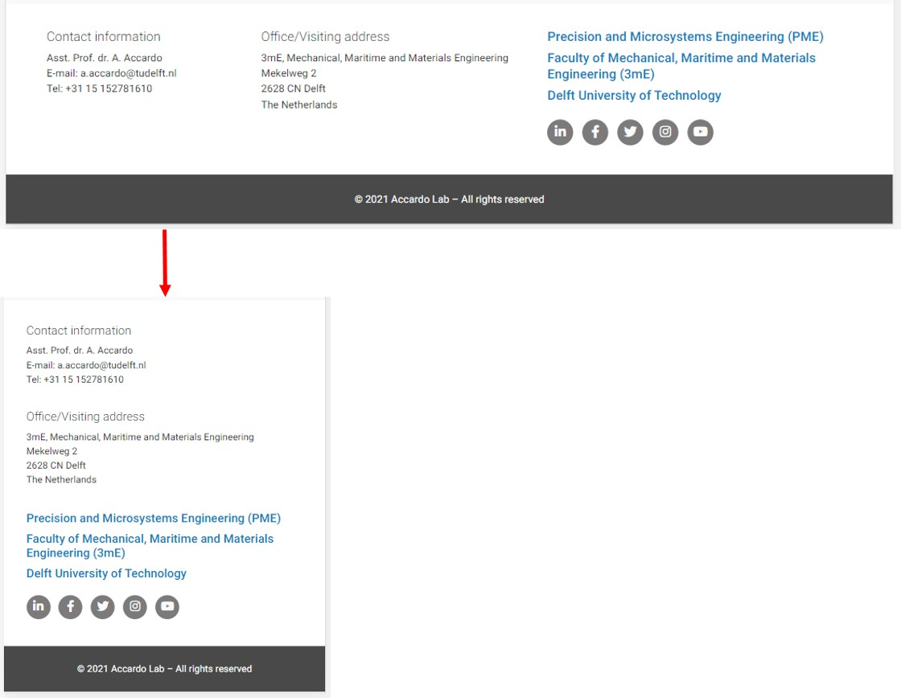
    
**Figure S1.** Additional white space causing a horizontal scrolling (indicated by red arrows).

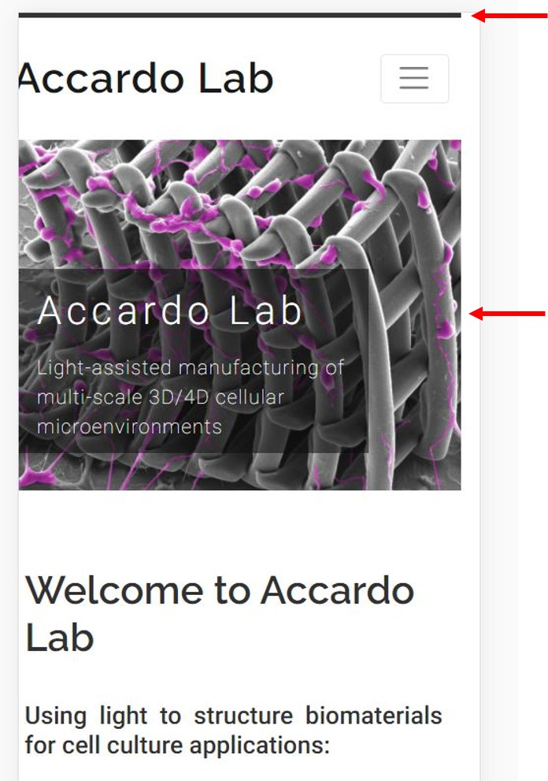

**Figure S2.** Result in W3C Markup Validator.

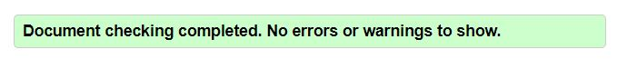

**Figure S3.** Result in W3C CSS Validator. (a) No errors in the code. (b) Two warning messages about the same background and border colour. (c) The same grey colour for a background and border was left deliberately to separate the journal cover (of white colour) from the rest of the page (indicated by red arrows).

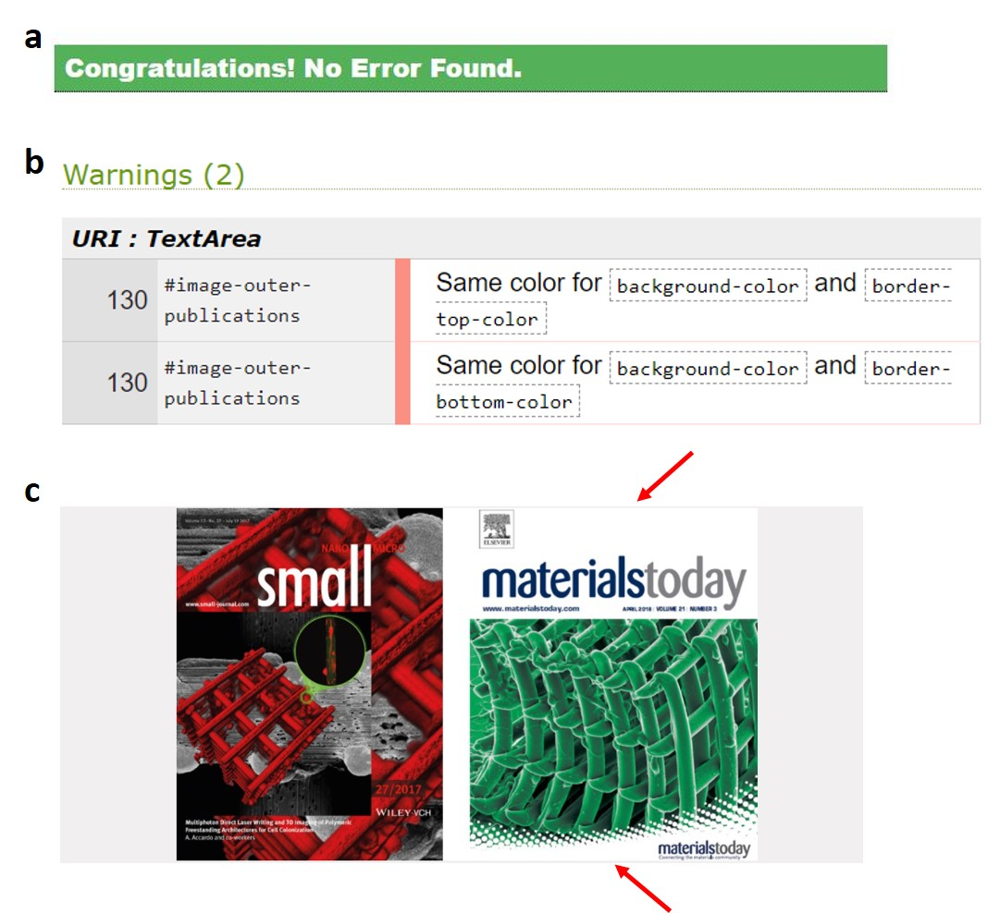

**Figure S4.** Result in Lighthouse. 

**Figure S5.** An overlap between photos and text. 

