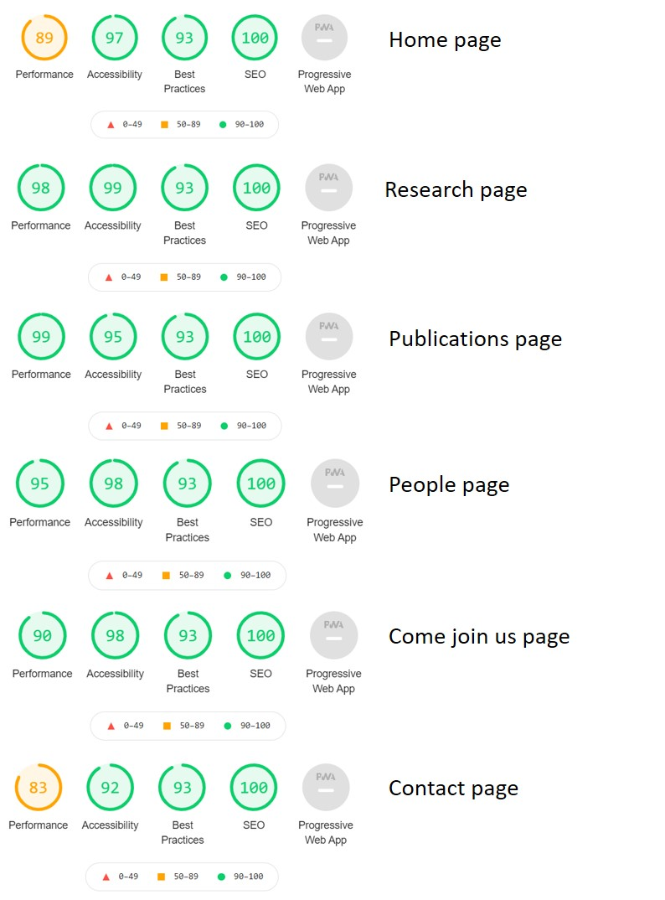

# Supplementary information

**Figure S1.** Initial bug: additional white space causing a horizontal scrolling (indicated by red arrows).

**Figure S2.** Result in W3C Markup Validator.

**Figure S3.** Result in W3C CSS Validator. (a) No errors in the code. (b) Two warning messages about the same background and border colour. (c) The same grey colour for a background and border was left deliberately to separate the journal cover (of white colour) from the rest of the page (indicated by red arrows).

**Figure S4.** Result in Lighthouse. 

