# Testing User Stories from User Experience (UX) Section

- **I want to easily understand the main areas of research of the group and learn more about it.**

  - Upon entering the site, users are automatically greeted with a clean and easily readable navigation bar to go to the page of their choice. Underneath there is a hero image with a cover text (the main points are made immediately with the hero image).

    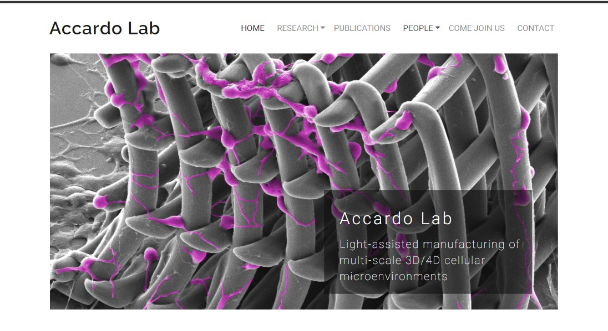

  - The user can scroll down and read the main goals of the group.

    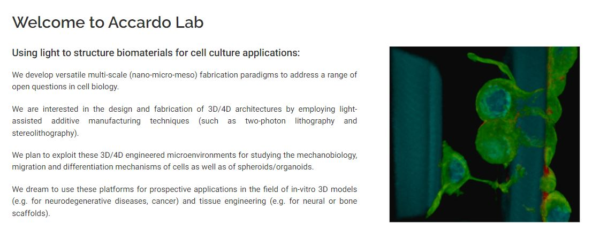

  - The user can click on *Research*, appreciate the microfabricated scaffolds illustrated in the hero image of the page and get a first impression on the scientific activity of the group. 
    
    

  - The text below than briefly describes the main concepts (this is also supported with a schematic image and video where one of the PhD students of the group describes his research project). 
    
    

  - Further there is a slide show presentation with the main instruments available at the lab as well as a list of the lab courses.

    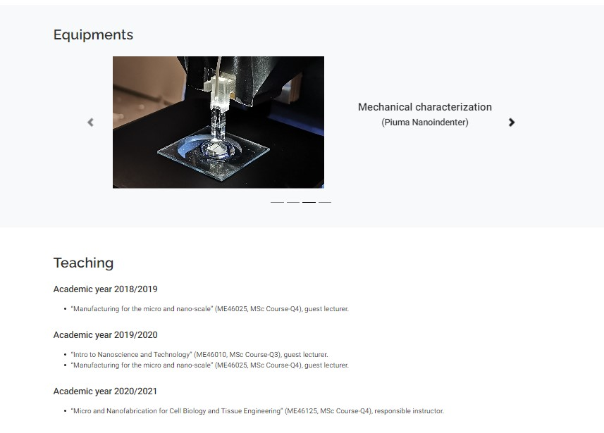
  
- **I want to be able to easily navigate throughout the site to find content.**

  - At the top of each page there is a clean navigation bar, each link describes what the page they will end up at clearly.

  - The logo title (*Accardo Lab*) always leads back to the *Home* page.

    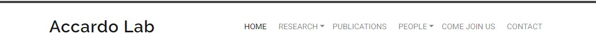

  - As it is usually expected, at the bottom of each page there is a footer that contains contact information and social links.

    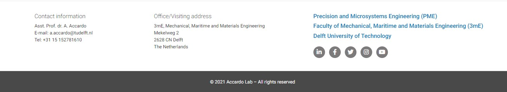
  
- **I want to look for a publication list with DOI links provided.**

  - User can find the full list of publications on the *Publications* page which is clearly labelled and easy to find in the navigation on every page.

    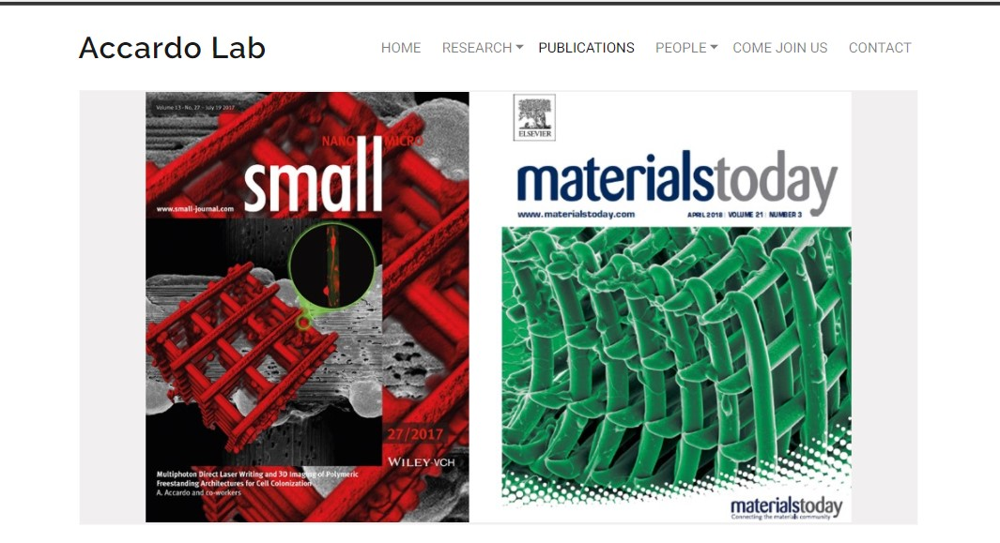

  - Each article has a DOI link that brings to the journal website with the publication. This significantly reduces the user's search time.

    

- **I want to find contact information for discussing possible collaborations.**

  - The contact information can be found on the *Contact* page and at the bottom of each page (footer). 

    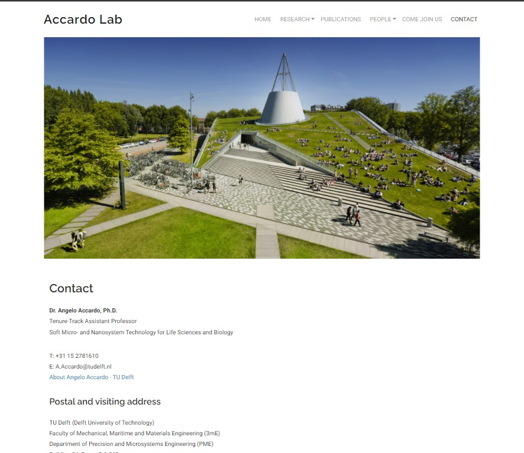

  - The *Contact* page also contains a Google map for the visiting address.

    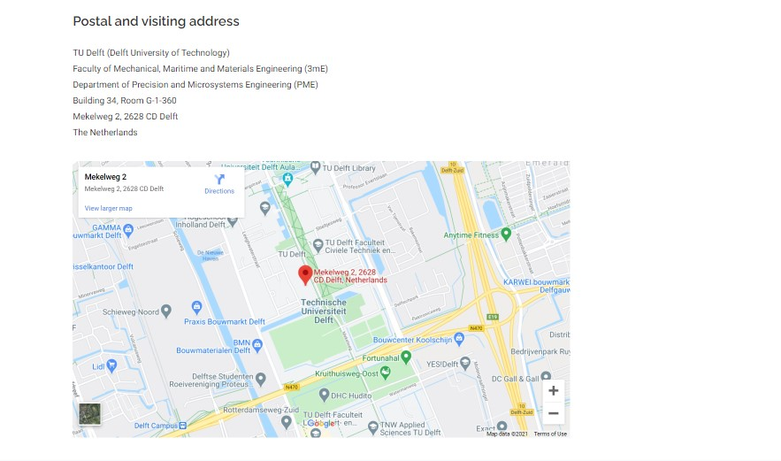

  - The email addresses of key group members (group leader and PhD students) are provided on the *People* page next to the photos.

    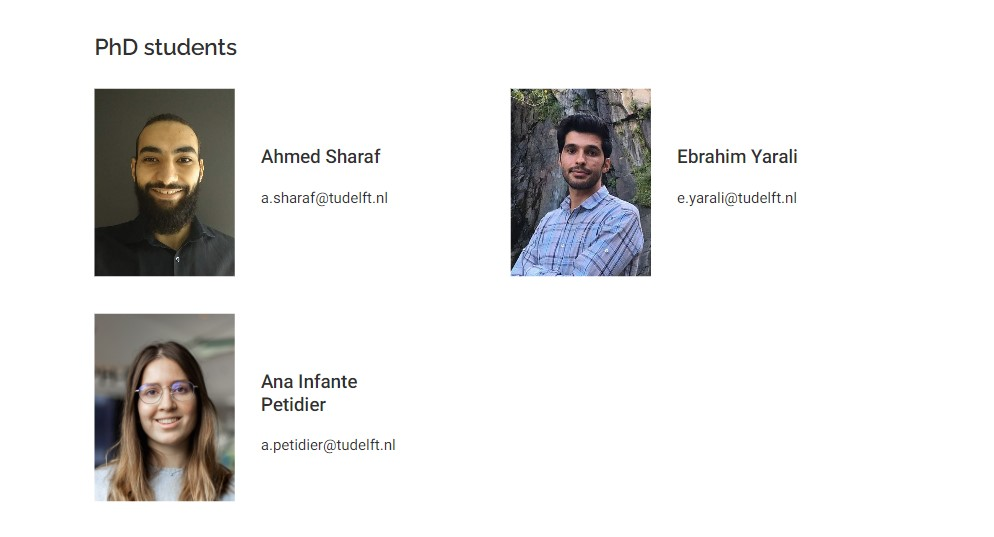
  
- **I want to look for the currently available Master students assignments.**

  - A clearly labelled *Come join us* page is easy to find in the navigation bar on every page.
  - Upon entering the *Come join us* page, a Master student will see a hero image illustrating a work in the laboratory. This should immediately create a right impression of an experimental research in the group rather than theoretical one.
  - A Master student can find the list of available thesis projects after the hero image.

    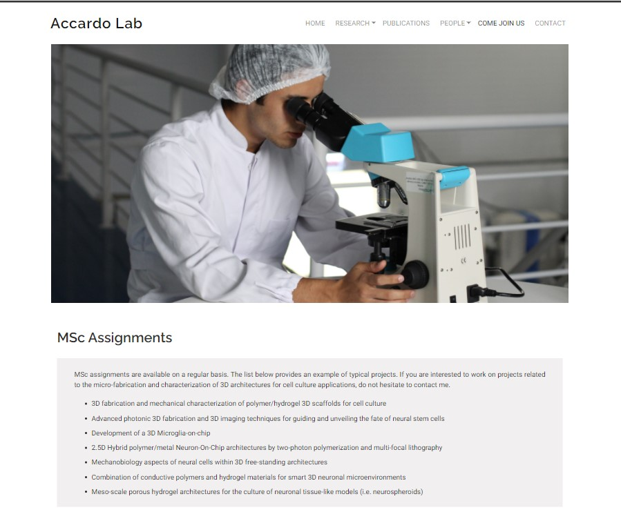

- **I want to look for the currently available job positions.**

  - The potential candidate can easily find open vacancies on the *Come join us* page. 
  - A clearly labelled *Come join us* page is easy to find in the navigation bar on every page.

    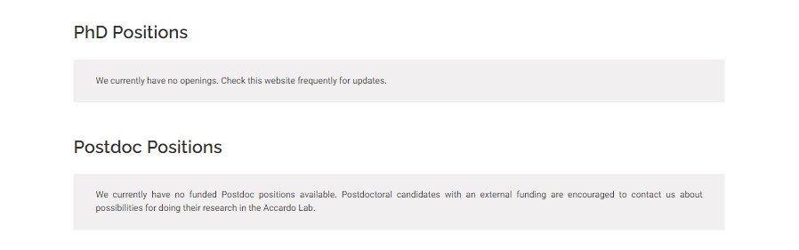

- **I want to locate social media links to see their followings on social media.**

  - Social links can be found at the bottom of each page.
  - Additionally the links to the hierarchically higher institutions can be also found: the websites of the department, faculty and university.

    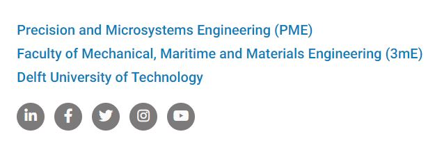

- **I want to see the list of group member.**

  - User can find the list of group members on the *People* page. 
  - A clearly labelled *People* page is easy to find in the navigation bar on every page.
  - Each group member is presented with his photo, name and email address (if available).

    

- **I want to be updated on the recent events of the group.**

  - User can find the latest news of the group on the *Home* page presented by an interactive element (Bootstrap carousel) which briefly presents the recent group activity.

    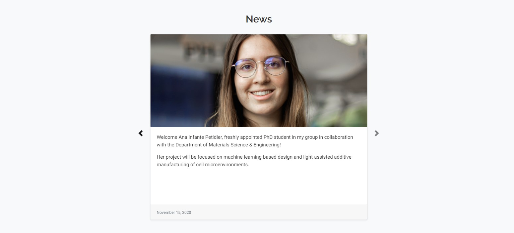